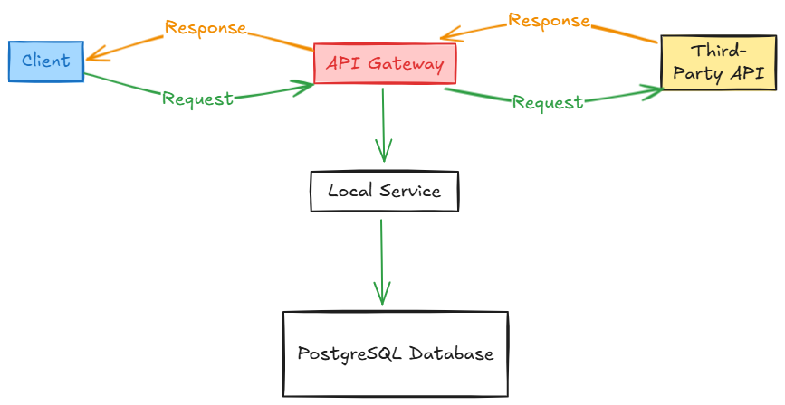

Simple API Gateway For Route Api From Third Party Service
==================================
## Description
This is a simple API Gateway for routing API requests from a third-party service to a local service.
It also converts the third-party API to a new API endpoint for the local service so that the local service can public API endpoints.
The API Gateway is built using Golang Language and uses a PostgreSQL database to store logs of the API requests.

## Features
- Client: Sends HTTP requests to the API Gateway.
- API Gateway: Routes requests to either the third-party API or the local service.
- Third-Party API: External service that the API Gateway interacts with (e.g., Goong API).
- Local Service: Internal service that the API Gateway interacts with.
- Database: PostgreSQL database used to store logs and other data.

## Project Layout
```
api-gateway/
├── .github/
│   ├── workflows/
│   │   ├── ci.yml
├── config/
│   ├── postgres.go
├── database/
│   ├── docker_compose.yml
│   ├── logs.sql
├── middleware/
│   ├── proxies.go
├── models/
│   ├── models.go
├── services/
│   ├── services_a.go
├── .env
├── .gitignore
├── go.mod
├── main.go
├── README.md
```

## Project Structure
- `.github/`: Contains GitHub Actions workflows for the project.
- `.github/workflows/ci.yml`: Contains the CI workflow for the project.
- `config/`: Contains configuration files for the project.
- `config/postgres.go`: Contains configuration for the PostgreSQL database.
- `database/`: Contains database configuration files.
- `database/docker_compose.yml`: Contains Docker Compose configuration for the PostgreSQL database.
- `database/logs.sql`: Contains SQL queries for creating tables in the PostgreSQL database.
- `middleware/`: Contains middleware functions for the project.
- `middleware/proxies.go`: Contains proxy middleware functions for the project.
- `middleware/rate_limit.go`: Contains rate limit middleware functions for the project.
- `models/`: Contains models for the project.
- `models/models.go`: Contains models for the project.
- `services/`: Contains services for the project.
- `services/services_a.go`: Contains service_a functions for the project.
- `.env`: Contains environment variables for the project.
- `.gitignore`: Contains files and directories to ignore.
- `go.mod`: Contains dependencies for the project.
- `main.go`: Contains the main function for the project.
- `README.md`: Contains information about the project.

## Installation
1. Clone the repository:
   ```bash
   git clone -b master git@github.com:ngxvu/3rd-party-gateway
    ```
2. Change into the project directory:
   ```bash
   cd 3rd-party-gateway
   ```

3. Create a `.env` file in the project root directory and add the following environment variables:
   ```bash
    DB_USER=postgres
    DB_PASSWORD=postgres
    DB_NAME=api_gateway
    DB_HOST=localhost
    DB_PORT=5432
    PORT=8081
    ```
4. Start the PostgreSQL database using Docker Compose:
5. Run the following command to start the PostgreSQL database:
   ```bash
   docker-compose -f database/docker_compose.yml up -d
   ```
6. Create the tables in the PostgreSQL database:
   ```bash
    psql -h localhost -U postgres -d api_gateway -a -f database/logs.sql
    ```
7. Run the following command to start the API Gateway:
8. Run the following command to start the API Gateway:
   ```bash
   go run main.go
   ```
9. The API Gateway will start running on `http://localhost:8081`.
10. You can now make requests to the API Gateway using the following endpoints:
    - `GET /api/v1/service_a`
11. This is just and example of how to use the API Gateway. You can add more services and endpoints as needed.
