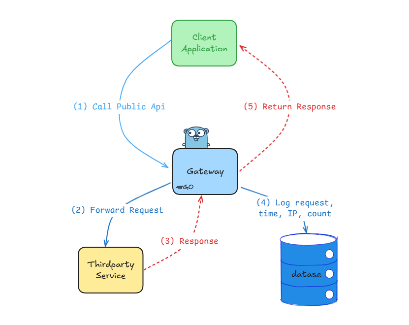

# Simple API Gateway For Route Api From Third Party Service 

[](https://go.dev/doc/install)
[](https://www.docker.com/)
[](https://www.postgresql.org/)
[](https://www.postman.com/)

<p align="center">
  
</p>


## Overview
This project is a simple API Gateway written in Go, designed to route API requests from clients to a third-party service and log all requests/responses to a PostgreSQL database. It exposes new API endpoints for local use and provides a logging mechanism for all API interactions.

## Features
- Routes client requests to third-party APIs.
- Logs all API requests and responses to PostgreSQL.
- Easy configuration via environment variables.

## Project Layout
```
3rd-party-gateway/
├── config/
│   ├── api_key.go
│   ├── postgres.go
├── database/
│   ├── docker_compose.yml
│   ├── logs.sql
├── middleware/
│   ├── proxies.go
├── models/
│   ├── models.go
├── services/
│   ├── services_a.go
├── .env
├── go.mod
├── main.go
├── README.md
```

## Directory Structure

- `config/`: Configuration files for the project.
    - `config/postgres.go`: PostgreSQL database configuration.
    - `config/api_key.go`: API key configuration.
- `database/`: Database-related files.
    - `database/docker-compose.yml`: Docker Compose configuration for PostgreSQL.
    - `database/logs.sql`: SQL for creating tables in PostgreSQL.
- `middleware/`: Middleware functions.
    - `middleware/proxies.go`: Proxy middleware functions.
- `models/`: Data models.
    - `models/models.go`: Log model for storing API logs.
- `services/`: Service logic.
    - `services/services_a.go`: Service A functions.
- `.env`: Environment variables.
- `go.mod`: Go module dependencies.
- `main.go`: Main entry point.
- `README.md`: Project documentation.

## Requirements

- [Go](https://golang.org/dl/) v1.23+
- [Docker](https://docs.docker.com/get-docker/) v20.10.7+
- [Docker Compose](https://docs.docker.com/compose/install/) v1.29.2+
- [PostgreSQL](https://www.postgresql.org/download/) v13.3+ (Dockerized)
- [Postman](https://www.postman.com/downloads/) v8.10.0+ (optional, for testing)

## Installation & Setup

#### 1. Clone the repository

```
git clone https://github.com/ngxvu/3rd-party-gateway.git
cd 3rd-party-gateway
```

#### 2. Configure environment variables
   Create a .env file in the project root:

```
DB_HOST=localhost
DB_USER=postgres
DB_PASSWORD=postgres
DB_NAME=api-gateway
DB_PORT=5433
DB_SSLMODE=disable
SERVICE_A_API_KEY=your_service_a_api_key
```

#### 3. Start PostgreSQL with Docker

```
docker-compose -f database/docker-compose.yml up -d
```
This will start a PostgreSQL instance on port 5433.

#### 4. Create the logs table
```
docker exec -it <container_id> psql -U postgres -d api-gateway -f /var/lib/postgresql/data/logs.sql
```
Or from your host (if psql is installed):
```
psql -h localhost -U postgres -d api-gateway -p 5433 -f database/logs.sql
```

#### 5. Run the API Gateway

```
go run main.go
```
The server will start on http://localhost:8081.

## Usage

- GET /api/v1/service-a/endpoint-1
- GET /api/v1/service-a/endpoint-2

## Code Explanation

- **main.go**: Loads environment variables, initializes the database, sets up HTTP routes, and starts the server.
- **config/postgres.go**: Handles PostgreSQL connection using environment variables and GORM.
- **config/api_key.go**: Loads the third-party API key from environment variables.
- **middleware/proxies.go**: Proxies requests to the third-party API, appending the API key and query parameters.
- **models/models.go**: Defines the Log model for storing API logs in PostgreSQL.
- **services/service_a.go**: Contains the controller for handling API requests, proxying them, and logging the results.


Replace `your_service_a_api_key` with your actual API key. This README provides all necessary steps and explanations for setup and usage.